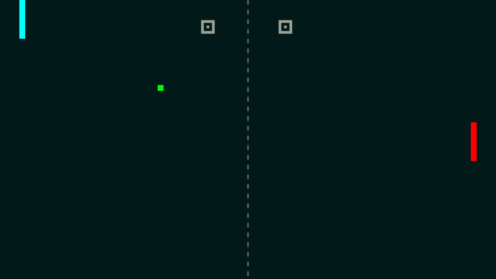
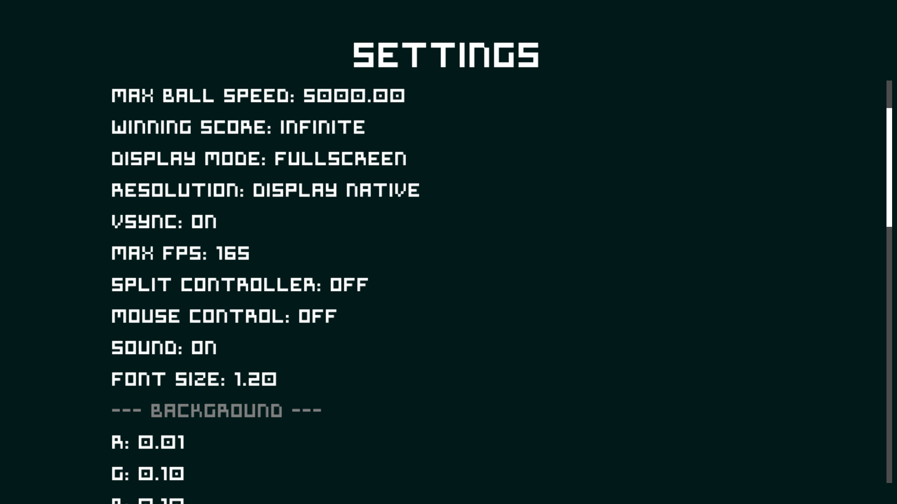

# Paddles

A fast, polished Pong-style game built with the LÖVE 2D engine.

## Screenshots





## Overview

`Paddles` is a local multiplayer and single-player Pong recreation featuring:
- Singleplayer mode with 4 AI difficulties (Easy, Medium, Hard, God)
- Local multiplayer mode
- Bot vs Bot mode (each bot can have its own difficulty)
- In-game settings for controls, display, and gameplay
- Customizable paddle, ball, and UI colors
- Standalone Windows executable and Linux installer available

## Features

- Classic Pong gameplay with responsive paddle and ball physics
- Progressive AI difficulty: Easy is sluggish, Hard plays at full speed
- Hall reverb on all sound effects
- Configurable trail effect
- Split controller support for shared gamepads
- Mouse control option for Player 1
- Adjustable ball speed, max speed, and winning score
- Resolution, fullscreen, VSync, and frame limiter settings

## Installation

### From source

1. Install [LÖVE](https://love2d.org/) version 11.0 or later.
2. Clone or download the repository.
3. Run from the project folder:

```bash
love .
```

### Pre-built packages

Run `./scripts/package.sh` to generate a `dist/` folder containing:

| Platform | Folder | How to run |
|----------|--------|------------|
| **Linux** | `dist/linux/` | `./launch.sh` or `sudo ./install.sh` for system-wide install |
| **Windows** | `dist/windows/` | Double-click `paddles.exe` |
| **Any (LÖVE)** | `dist/love/` | `love paddles.love` |

## Controls

### Menu Navigation
- `Up` / `Down` arrows: move menu selection
- `Enter` or `Space`: confirm selection
- `Escape`: back / quit from the menu
- Gamepad `DPAD` and `A` buttons are supported

### Player Controls
- Player 1: `W` = up, `S` = down
- Player 2: `Up Arrow` = up, `Down Arrow` = down
- If a gamepad is connected, Player 1 can also use the left stick or D-Pad.
- With split controller enabled, both paddles can share the same gamepad (`lefty` / `righty` sticks).

### In-Game Pause
- `Escape` or gamepad `Start` / `B` to pause / return

## Settings

The settings screen allows you to customize:
- Paddle sensitivity (only affects human players)
- Ball speed and max ball speed
- Winning score (3, 5, 7, 11, 21, or Infinite)
- Display mode (Windowed / Fullscreen) and resolution
- VSync and maximum FPS
- Split controller mode
- Mouse control
- Trail effect length
- Sound on/off
- Font / UI scale
- Color sliders for background, menu, paddles, ball, and score

## Project Structure

```
├── main.lua                 — game loop and state manager
├── conf.lua                 — LÖVE window settings
├── scripts/package.sh       — build script for distribution
├── assets/
│   ├── fonts/font.ttf       — game font
│   ├── icons/paddles.png    — application icon
│   └── pictures/            — screenshots
└── src/
    ├── menu.lua             — main menu
    ├── aiselect.lua         — bot difficulty picker
    ├── input.lua            — keyboard and gamepad input
    ├── settings.lua         — settings menu
    ├── sound.lua            — procedural sound generation
    └── game/
        ├── init.lua         — game state, update, and rendering
        ├── entities.lua     — paddle and ball physics
        └── ai.lua           — AI behavior per difficulty
```

## Notes

- The game uses a virtual resolution of `1280x720`.
- The repository is designed to run directly in LÖVE without additional build steps.
- Run `./scripts/package.sh` to produce a standalone distribution.

## License

MIT — see [LICENSE](LICENSE) for details.
